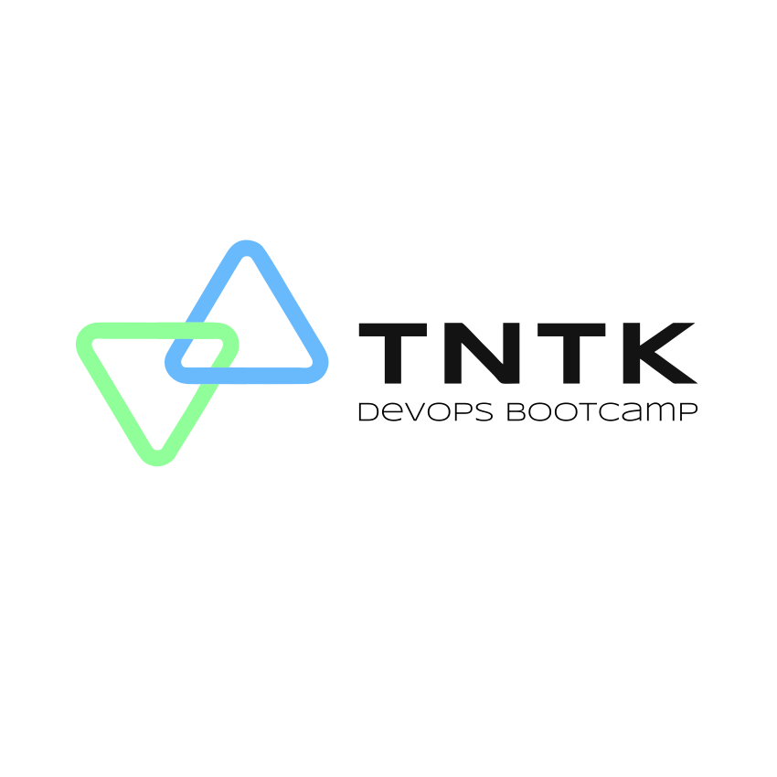

# TNTK Auth Module

Welcome to the `tntk-auth` repository! This module is part of the Tentek infrastructure and is responsible for handling authentication and user management within the system. It is built using Python and FastAPI, and it leverages Docker for containerization and Helm for Kubernetes deployment.

## Overview

The `tntk-auth` module provides a RESTful API for user authentication and management. It includes endpoints for user registration, login, and CRUD operations on user data. The module uses JWT tokens for secure authentication and integrates with a PostgreSQL database for data persistence.

## Key Features

- **User Registration and Login**: Allows users to register and log in using their email and password.
- **JWT Authentication**: Secures API endpoints with JSON Web Tokens.
- **CRUD Operations**: Provides endpoints to create, read, update, and delete user information.
- **Database Integration**: Uses SQLAlchemy for ORM and PostgreSQL for data storage.

## Prerequisites

Before you begin, ensure you have the following installed:

- **Docker**: For containerizing the application.
- **Kubernetes**: To deploy the application using Helm.
- **Helm**: A package manager for Kubernetes.

## Getting Started

### Clone the Repository

To get started, clone the repository to your local machine:

```bash
git clone https://github.com/tntk-io/tntk-auth.git
cd tntk-auth
```

### Build and Run with Docker

The application is containerized using Docker. You can build and run the Docker image with the following commands:

```bash
docker build -t tntk-auth .
docker run -p 8000:8000 tntk-auth
```

This will start the FastAPI application on `http://localhost:8000`.

### Deploy with Helm

To deploy the application on a Kubernetes cluster using Helm, follow these steps:

1. **Package the Helm Chart**: Navigate to the Helm chart directory and package the chart.

   ```bash
   helm package ./chart
   ```

2. **Install the Chart**: Use Helm to install the chart on your Kubernetes cluster.

   ```bash
   helm install tntk-auth ./chart
   ```

This will deploy the `tntk-auth` application to your Kubernetes cluster.

## Configuration

The application can be configured using environment variables defined in the `.env` file. Key configuration options include:

- `DATABASE_URL`: The URL for the PostgreSQL database.
- `SECRET_KEY`: The secret key used for JWT token generation.

## License

This project is licensed under the MIT License. See the [LICENSE](LICENSE) file for details.

## Contact

For questions or support, please contact the Tentek DevOps team.

---

This README provides a high-level overview of the `tntk-auth` module, its features, and instructions for building and deploying it using Docker and Helm. For more detailed information, refer to the source code and comments within the repository.

